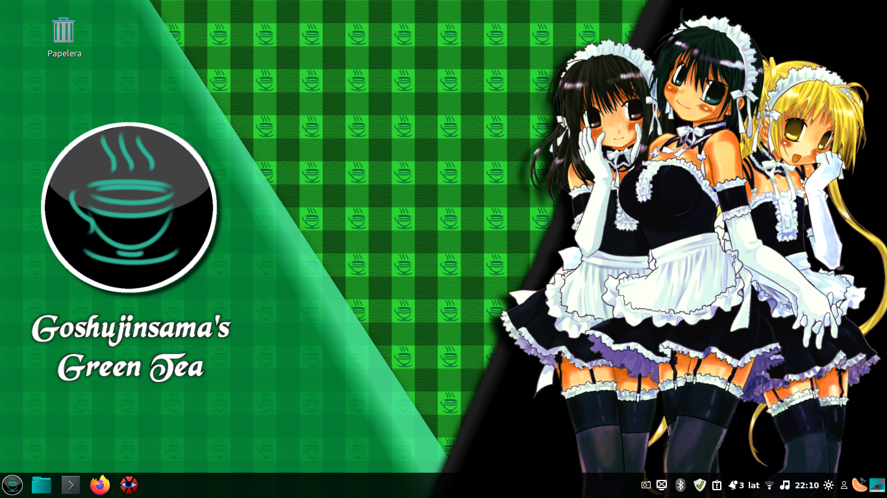
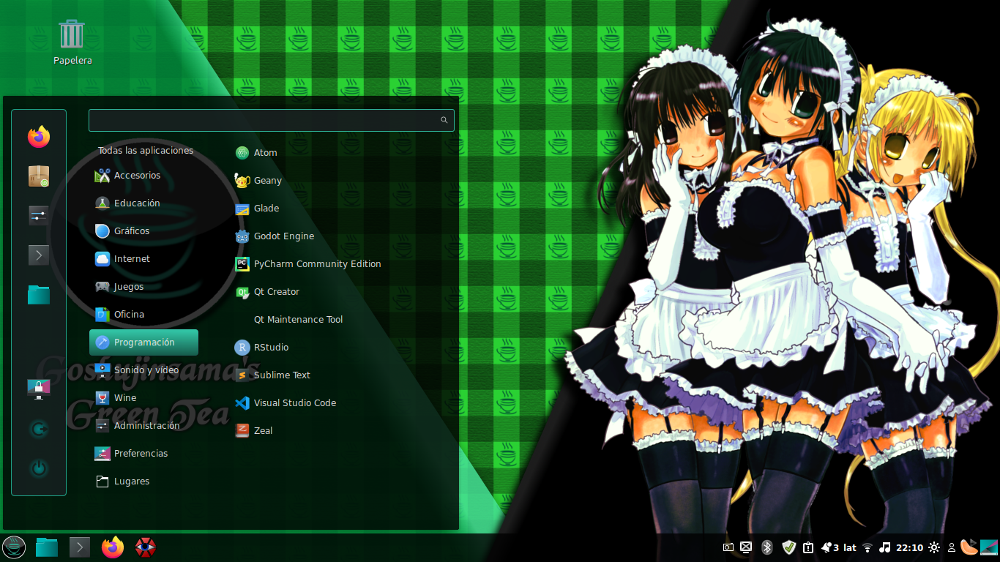
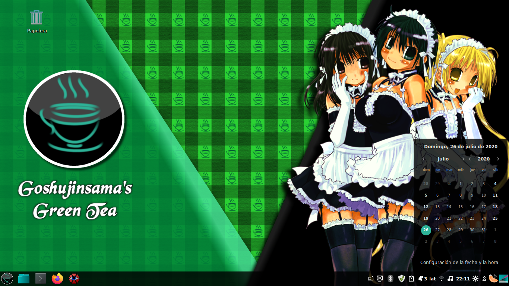
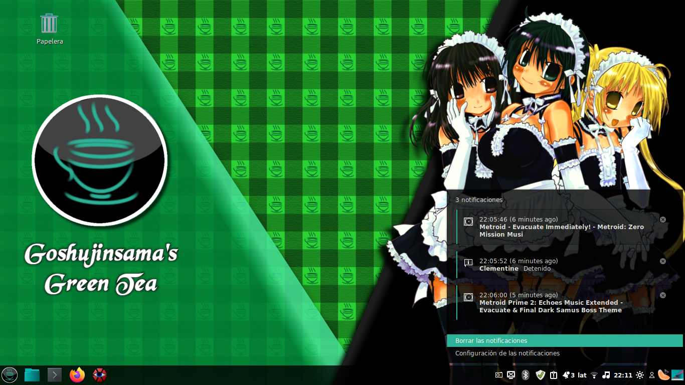
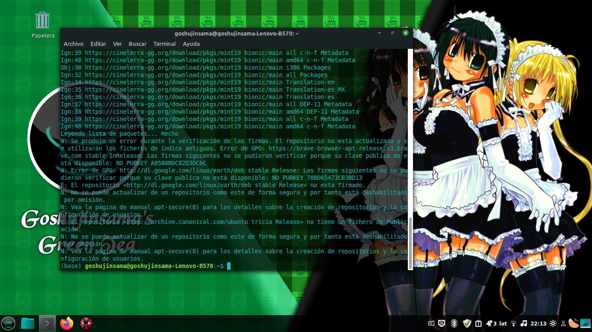
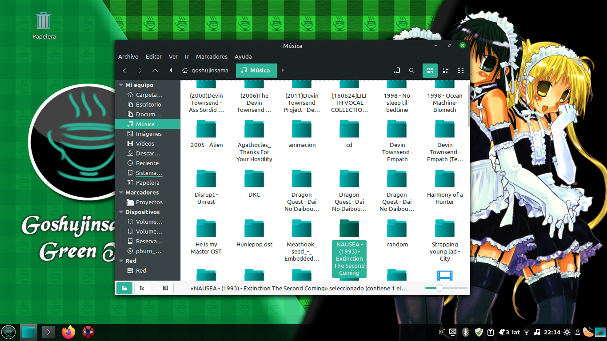

# **Goshujinsama's green tea - Cinnamon Theme**

Goshujinsama's green tea is a theme for Cinnamon desktop manager, is **based in the Cinnamon**
**theme from Matcha GTK theme by vinceliuice**. This theme is aimmed to Linux Mint, so includes
a modification of the GTK Theme for Nemo and other programs to match the Cinnamon Theme.

[**Matcha GTK theme by vinceliuice:**](https://github.com/vinceliuice/Matcha-gtk-theme)

**Note:** This theme doesn't recieve any support from vinceliuice or the Matcha GTK Theme team.
This theme was done modifiyng the css files directly, so I think maybe this will be the
only release that I work that way. In future I like to work as the HACKING file in Matcha GTK
theme says, but maybe that modification will be in another repository.

**Goshujinsama's green tea  Copyright (C) 2020  Guadalupe Fernando Escutia Rodriguez**
This program comes with **ABSOLUTELY NO WARRANTY**. This is free software, and you are welcome
to redistribute it under certain conditions.

## **Info**

This theme requires  **GTK+ > 3.20**. The requirements for **GTK2** are:

- GTK2 engine Murrine 0.98.1.1 or later.
- GTK2 pixbuf engine or the gtk(2)-engines package.

In case you don't meet this requirements you can install these requirements in Linux Mint
through Terminal:

> sudo apt-get install gtk2-engines-murrine gtk2-engines-pixbuf

This theme was tested in Linux Mint 18.3 Cinnamon and Linux Mint 19.3 Cinnamon.

## **Installation**

You need to make the INSTALL.sh script executable with chmod command:

> sudo chmod +x INSTALL.sh

Then you can run the script on the terminal to install this theme.

Also, you can change the menu button icon for the icon file "Icon_248.png" if you want.

**Manual install**

Just copy the cinnamon, gtk-2.0 and gtk-3.0 folders, and the index.theme file in a new
folder in $HOME/.themes.

Also, you can change the menu button icon for the icon file "Icon_248.png" if you want.

## **Screenshots**

# **Thanks for viewing**